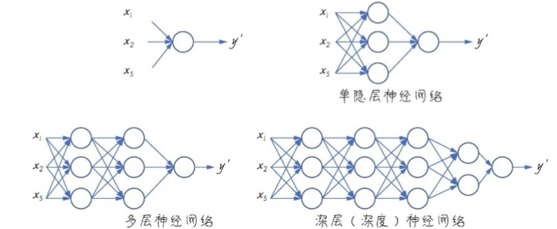
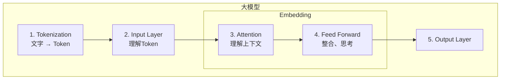
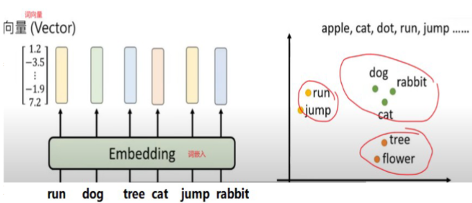

## GPT 

人工智能研究实验室OpenAI在2022年11月30日发布的全新聊天机器人ChatGPT，背后的GPT模型GPT模型是一种基于Transformer架构的生成模型，它可以生成文本、代码、图像、音频和视频等。

### GPT and GPTChat

1. G > **Generative**: **生成式**，意味着模型可以生成文本，根据给定的起始词或句子，预测文字生成的先后概率，形成一段连续的文本输出
2. P > **Pre-trained**: **预训练**，模型在用于特殊任务前，先通过大规模文本数据进行预训练，学习语言的基础知识，比如语法、拼写和常识等
3. T > **Transformer**:一种特定的深度学习模型结构，引入"**自注意力机制**"使得模型在处理文本能理解更复杂的句子结构和语义


## 神经网络 

全称为**人工神经网络(Artificial Neural Network, ANN)**，是一种受生物神经系统启发而设计的计算模型。
由大量相互连接的**节点**（或称神经元）组成，旨在模仿人类大脑处理信息的方式。

1. **卷积神经网络（Convolutional Neural Network, CNN）**：特别适合处理具有网格结构的数据，如图像，广泛应用于计算机视觉领域。
2. **循环神经网络（Recurrent Neural Network, RNN）**：用于处理序列数据，能够记住过去的信息并将其应用于当前的处理过程中。但是处理的序列不能太长，否则会有遗忘。
3. **长短时记忆网络（Long Short-Term Memory, LSTM）**，是一种特殊的循环神经网络（RNN）。LSTM是RNN的改进版本，能更好地捕捉长距离依赖关系，比如语言、视频、股票价格等需要联系上下文的信息。其核心能力：记住重要的，忘记不重要的。
4. **Transformer**

### 感知机 

神经网络之父--辛顿

**感知机(Perceptron) 是机器学习中的基本单元.**

> - 可以简单把它理解为一个判断函数，接收输入，产生输出。输出可以被限定为只能是0或1，也可以限定为是0~1之间的一个数
> - 从**单个感知机发展到多个感知机**，可以组成单层神经网络，层数目超过一个，就逐渐由“浅”入“深”，**从机器学习领域进入深度学习/深度神经网络**学习的领域。
> - 所谓“深”，只是相对而言的。相较于单层，十几层的层的神经网络也可以称得“深”。而大型的深度神经网络经常达到成百上千层，则十几层的网络也显得很“浅”。




## **Transformer**:

Transformer属于深度学习/深度神经网络的一种， 最初在2017年提出。它是一种**基于注意力机制**的模型，用于处理序列到序列的任务，如机器翻译、语言建模等。

> 优势：
> - **并行计算**：Transformer可以充分利用现代计算硬件进行并行计算，大大提高了训练速度。
> - 捕捉长距离依赖：**自注意力机制**使得每个位置的输入可以与序列中其他位置的所有信息进行交互，这大大增强了模型捕捉长距离依赖的能力。
> - 可扩展性：Transformer架构更容易**扩展**到更大的模型和更多的数据，也更容易提升模型的表达能力。
> - 灵活性和效果：Transformer不仅能高效地处理**长序列**，还能够在多种**NLP任务**中取得良好的效果。无论是机器翻译、文本生成、语义理解，Transformer都能展现出色的性能。

### Transformer工作原理

Transformer模型的生成过程可以分为以下4个核心内容：
1. **分词（Tokenization）** ----token
2. **词嵌入（Embedding）** ----预训练（欧氏距离）
3. **注意力机制（Attention Mechanism）** ----多头注意力机制（KQV）
4. **最终的内容生成（Content Generation）** ----编码器、解码器




```
Transformer模型结构
├── 数据准备阶段
│   ├── 分词
│   └── 词嵌入（预训练得到固定的向量表）
│
├── 编码器-解码器架构（是一个框架）
│   ├── 编码器（包含多个层）
│   │   └── 每层都包含：注意力机制 + 前馈网络
│   └── 解码器（包含多个层）
│       └── 每层都包含：掩码自注意力 + 交叉注意力 + 前馈网络
│
└── 输出生成阶段
    └── 线性层 + Softmax（生成最终内容）
```

### Token

**文本的最基本单位 —— 单词/字**

1. 嵌入大模型的 **Byte Pair Encoding** 算法，将句子拆解成多个分词，每个模型拆解结果都不一样。

    > 一条语句由诸多单词/字（Word）所组成，大模型在进行处理前需要先将语句拆解成一个个的基础单元：
    > 中文：“长沙的雨” → [“长沙”，“的”，“雨”]（3个Token）
    > 英文: “Rain in Changsha” → [“Rain”, “in”, “Changsha”]（3个Token）
    > 句子 “长沙明天暴雨，记得带伞”
    > Token列表：[“长沙”，“明天”，“暴雨”，“记得”，“带伞”]

2. 通常1个中文词语、1个英文单词、1个数字或1个符号计为1个token。**不同模型token规则不同**
3. 词与词之间存在不同的远近亲疏关系


### 词向量(Word Verctor)和词嵌入(Word Embedding)

词向量（Word Vector）**≈** 词嵌入（Word Embedding）

1. **向量**：有大小又有方向的量
2. **词向量（Word Vector）** ：用多维向量表示词语/token。方便后续计算词语之间的距离，判断词语之间的相似度。

    > “长沙的雨”→[“长沙”，“的”，“雨”]（3个Token）
    > 每个Token被换成一个由很多数字（几百到几万个）组成的列表，可以被称为词向量
    > 三维坐标里“长沙”这个token的词向量可以是：[4, 2, 0.5]
    > **大模型没有训练前所有token的词向量都随机分布在固定维度的坐标系中**
    > **训练后的词向量是固定的，以后使用就是查询词向量库**
    

3. **词嵌入（Word Embedding）** ：将词向量映射到多维空间的动作叫做词嵌入。让相似的词向量在空间中靠在一起，从而提高词向量的相似度计算效率。
    
   > token经过神经网络**词嵌入层**训练后，词向量固定，意思相近的词会有相近的词向量
   >
    > 
    > **如何判断两个向量相似度？**
    > 欧氏距离：两个向量顶点间的直线距离，越小越相似
    > 曼哈顿距离：两个向量顶点间的直线距离，越小越相似
    > 余弦相似度：两个向量之间的夹角，越小越相似


## 注意力机制

论文： [Attention Is All You Need](https://arxiv.org/abs/1706.03762)

**捕捉词语之间的关联**的能力就是**Attention**

注意力机制核心思想是让模型在处理某个token时，动态关注其他相关的token

### **KQV**

每个token会生成三个向量：

1. **Query**：表示当前token的提问
2. **Key**：表示其他token的标识
3. **Value**：表示其他token的实际信息

计算Q和K的相似度，得到注意力权重

### 权重计算

$$
\text{Attention}(Q, K, V) = \text{softmax}\left(\frac{QK^T}{\sqrt{d_k}}\right)V
$$

$softmax$ : 将相似的转化为概率分布（权重）
$d_k$ : Key的维度，用于缩放梯度

### 动态聚焦

权重高的token会更关注，对当前token影响更大

> “天气预报说长沙明天有暴雨”这句话
听到 “暴雨”时，人类会自动关联或注意到 “长沙”（地点）和 “明天”（时间）
听到 “明天”时，人类知道它修饰的是 “暴雨”，而不是前面的 “天气预报”
>
> 什么是注意力机制？
> 大模型处理： “天气预报说长沙明天有暴雨”
> Transformer架构会让 “暴雨” 给每个词打分（权重）：
> 长沙（0.8）：强相关（地点）
> 明天（0.7）：强相关（时间）
> 预报（0.3）：弱相关
> 其他词（0.1）：不相关


### 多头注意力机制

> 像老师分析课文会从 “语法”“情感”“背景” 多个维度进行，大模型的注意力机制也会从多个方面进行
> 
> 假设多头注意力有3个 “小注意力” ：
> 头1：关注主谓宾（“长沙→暴雨”）
> 头2：关注时间地点（“明天→长沙”）
> 头3：关注信息来源（“天气预报→暴雨”）
> 每个头会学到不同的关联模式，算出不同的注意力分数，最后把结果拼起来会得“总注意力”
> 
> **多头注意力机制**
> 注意：每个头关注什么维度，其实是为了方便理解。因为准确来说，注意力机制只是计算词之间关联性大小的分数


## Transformer工作过程

为什么向大模型提出‘从前有个国王，他有个女儿’ ，大模型能给一个还不错的回答？

> 第一步：**Token** 化，拆分词用
> 从前|有个|国王|，|他|有个|女儿
>
> 第二步：基于语料库预训练得到**词向量**、，欧式距离进行**词嵌入**：
> 「国王」的词向量：[0.8（权力）, 0.6（城堡）, 0.3（严肃）…]
> 「女儿」的词向量：[0.7（公主）, 0.5（魔法）, 0.4（冒险）…]
>
> 第三步：**编码器**接收词向量结合注意力机制计算关联度（KQV）
>  "从前有个国王，他有个女儿"
> 1. 对这句话中的每个词（实际是向量），基于多头注意力机制，使用每个词的词向
量去计算这个词在这句话中「其他词对我的重要性/关联程度」，比如“女儿”
这个词
> 可能的“血缘”维度下：
>「女儿」和「国王」的关联度是90%，
>「女儿」和「从前」关联度只有10%
> 可能的 “叙事风格”维度下：
>「女儿」和「国王」的关联度是85%，
>「女儿」和「从前」关联度是80%
> .....
> 2. 计算后，这句话中“女儿”这个词的向量不再是只有原来词向量
>「女儿」=[0.7（公主）, 0.5（魔法）, 0.4（冒险）…]
> 还会多出一个新的向量「女儿新」，这个「女儿新」向量中融合了
>「国王」中包含的“权力”、“城堡” 等特征
> 以及
>「从前」中包含的“童话”、“女巫”、“森林”等特征
>「女儿_新」= [0.9, 0.7, 0.6…]
> ...
> 3. 这句话处理完成后，编码器交给解码器的至少包括:
>   - "女儿"：
>  「女儿」=[0.7（公主）, 0.5（魔法）, 0.4（冒险）…]
>  「女儿_新」= [0.9, 0.7, 0.6…]     # 新的是临时向量
>   - "从前"：
>  「从前」=[…]
>  「从前_新」=[…] 
>   - ....(一些其他内容)
>
> 第四步：**解码器**接收编码器的输出，不断计算下个词可能是什么，边编故事边查向量表，用注意力（KQV）确保连贯
> 1. 整句所有词的关联关系重新计算
> 2. 自己已经写的前文中的每个出现的新词（比如：公主、美丽等）也要和已有的词结合起来，计算下个词的概率，比如：
> “善良”出现的概率35%
> “温柔”出现的概率30%
> “邪恶”出现的概率20%
> ………出现的概率..
> 3. 解码器续写，准确度根据 **top_p** 和 **temperature** 来控制:
> ```
> 从前有个国王，他有个女儿，这位*公主*
> 从前有个国王，他有个女儿，这位公主*美丽*
> 从前有个国王，他有个女儿，这位公主美丽*又*
> 从前有个国王，他有个女儿，这位公主美丽又*善良*
> 从前有个国王，他有个女儿，这位公主美丽又善良*………*.
> ```

**注意**：如果训练使用的语料库不够大，容易出现 "**幻觉**" 现象