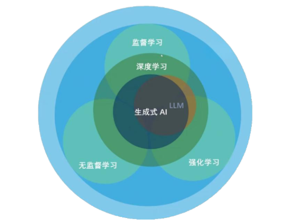
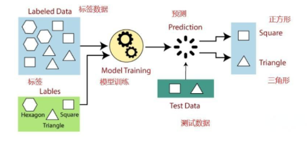
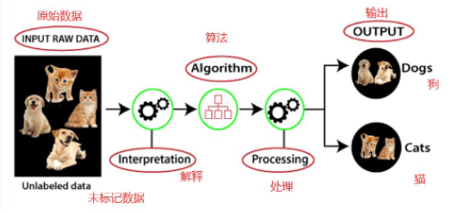
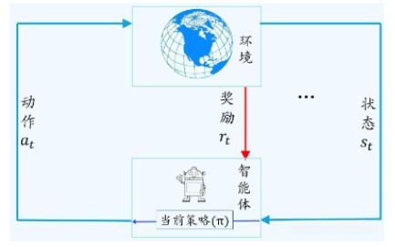

## 机器学习
监督学习
无监督学习
强化学习

### 监督学习 supervised learning
人们给机器一大堆标记好的数据
1. 一大堆数据（比如图片），用标签标记出哪些是三角形、哪些是正方形、哪些是六边形
2. 让机器学习这些数据，在学习的过程中，通过标签检查自己学习的是否正确，学习完成就会归纳出算法或模型
3. 使用该算法或模型判断出其他没有标签的新数据是否是三角形、正方形、六边形

> 需要人工标注，成本很高

### 无监督学习 unsupervised learning

人们给机器一大堆没有分类标记的数据，让机器自行对数据归纳分类、检测异常等。

> 不需要人工标注，机器自行归纳

### 强化学习 Reinforcement Learning

- 强化学习主要用来解决连续决策的问题，强化学习的目标一般是变化的、不明确的，甚至可能不存在绝对正确的标签
- 强化学习可以理解为一种让智能体（比如一个机器人或者一个程序）通过不断尝试和与环境互动来学习如何做出最优决策的方法。
- 根据得到的反馈来调整自己的行为策略，逐渐学会哪些行动能带来更多奖励，哪些行动会带来负激励或者惩罚，从而找到最优的行动方式

> 基于人类反馈

## 模型训练

> 模型成长三阶段：
>
> 1. 阶段一：**预训练（Rre-train）** 中通过 **自监督学习（Self-Supervised Learning）** 解决 **过拟合（overfitting）** 获得基座大模型（Foundation model）
> 2. 阶段二：**模型微调（Fine-tuning）** 中通过 **监督微调（Supervised Fine-Tuning，SFT）** 获得微调后更专业的模型
> 3. 阶段三：**基于人类反馈的强化学习（RLHF，Reinforcement Learning from Human Feedback）** 获得奖励模型，提高回答准确率

### 预训练 pre-training

通过机器学习的过程不断找参数就是模型的训练（training）, 训练可能不会一次成功，需要反复调整**超参数，上算力**再次进行训练（经费在燃烧）

### 超参数 Hyperparameter 

1. 超参数：训练开始前人为设定的配置值，固定值控制训练过程。
   
   - 包括多头注意力注意力头数（num_heads），
   - 向量表的学习率，
   - Transformer层数（num_layers），
   - 学习率（learning_rate），
   - 优化器类型（Adam还是SGD）等等。

2. 初始参数：是模型真正的参数（权重），只是还没学习，通常用随机数初始化（不能全为0），随着训练过程不断更新

3. 最优化**optimization**之后模型参数才能确定，包括超参数和初始参数

### 过拟合 overfitting

比如给出一个相册作为数据集，数据量不够，会产生**过拟合 overfitting**

> 给出一堆苹果图片（只有红色种类的苹果）
> 给出一堆葡萄图片（只有绿色种类的葡萄）
> 最后训练一个模型，给出一个绿色苹果图片，模型可能预测为葡萄
> 这就是数据量不够导致的过拟合 overfitting

### 自监督学习 Self-Supervised Learning

互联网抓取公开数据作为训练资料，这部分数据需要人工少量介入，这里涉及到**自监督学习Self-Supervised Learning**

训练资料抓取后要先进行数据清洗：
1. 过滤有害内容（黄赌毒）
2. 去除HTML标签符号，保留项目符号
3. 去除「低品质」内容（无意义骂街评论）
4. 去除重复资料

> 模型自学效果不是很好，比如GPT-3在专业领域判断结果最高60，需要人工来 “教学”

## 模型微调 Fine-Tuning

上面说过，只靠人类标注的数据量训练大模型，会因为数据太少出现过拟合现象

### 监督微调 Supervised Fine-Tuning，SFT

1. 第一阶段通用大模型训练的结果参数作为初始参数
2. 加上人工**数据标注（Instruction）**的少量专业数据样本
3. 训练出更专业的模型参数（和第一阶段不会差太多）

**基座模型** + **人工标注数据资料**

> 应用场景：
> 预处理的训练数据只有翻译，可以得到翻译模型
> 以翻译模型作为基座模型，旅游行业给出旅游攻略的相关专业资料
> 最后得到一个旅游专业模型

**注意**：
1. 闭源基座模型GPT参数不公开，无法进行微调
2. 但是Meta开源了LLaMA模型预训练参数，可以作为基座模型使用初始参数
   - [LLaMA1](https://arxiv.org/abs/2302.13971)
   - [LLaMA2](https://arxiv.org/abs/2307.09288)
   - [LLaMA3](https://huggingface.co/collections/meta-llama/meta-llama-3-66214712577ca38149ebb2b6)

