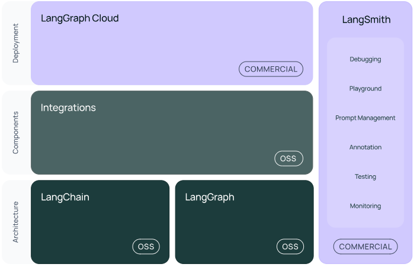
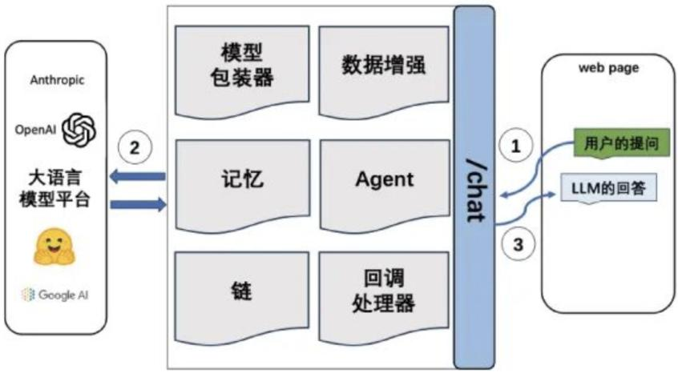

## LangChain 介绍

- LangChain 是一个开源 Python 库，是用于开发构建LLMs驱动的应用程序的框架。

- 类似的还有Dify、RAGFlow之类的开源平台，但是自由度受限

- LangChain允许开发人员将像通义千问、DeepSeek 这样的大语言模型与外部的系统和数据源结合起来去完成更多更复杂的和操作行为。

[官网地址](https://python.langchain.com/docs/introduction/)和[中文地址](https://www.langchain.com.cn/docs/introduction/)


> 地位类比:
> LangChain = Java 生态中Spring Boot与 Apache Camel 的结合体
>     Spring Boot式的“脚手架”:快速构建应用。例如,通过LangChain用10行代码实现智能客服系统
>     Apache Camel 式的”集成总线”:LangChain支持200+工具和服务,动态调用外部资源
> LangChain = C++生态中的 ROS+grpc


## LangChain 体系

> 
>
> 具体来说，该框架由以下开源库组成：
> 
> langchain:组成应用程序认知架构的链、代理和检索策略。
> langchain-core:基础抽象和LangChain 表达式(LCEL)。
> LangSmith:一个开发者平台，调试、测试、评估和监控LLM应用程序。
> 合作伙伴库（例如langchain-openai 、langchain-anthropic 等）：一些集成已进一步拆分为自己的轻量级库，仅依赖于langchain-core。
> LangGraph:通过将步骤建模为图中的边和节点，构建强大且有状态的多参与者应用程序。与LangChain无缝集成，但也可以单独使用。
> LangServe:将LangChain 链部署为REST API 服务。
> langchain-community :第三方集成。
> **LangChain简化了LLM应用程序生命周期的每个阶段：开发、测试、生产部署**

## langchain 开发环境
> **命令汇总**
> ```python
> # 创建一个虚拟环境
> python -m venv .langchain
> 
> # 激活环境
> .langchain/scripts/activate
> 
> # 查看已安装的包列表
> pip list
> 
> # cd /项目工作目录/,找到对应的requirements.txt 文件
> 
> # 使用requirements.txt 安装包
> pip install -r requirements.txt
> 
> # 根据最新的环境包状态生成 requirements.txt 文件
> pip freeze > requirements.txt
> 
> # 退出虚拟环境
> deactivate
> ```


## LangChain核心组件



> 1. **模型包装器(模型输入/输出(Model I/O))**:与语言模型交互的接口
    任何大模型应用程序的核心元素都是大模型。LangChain 提供了与任何语言模型交互的构建块，主要包含以下组件：
    语言模型Language Models、提示模板Prompt Templates、示例选择器Example Selectors、输出解析器Output Parsers等等
> 2. **数据连接(Data connection)**:与特定应用程序的数据进行交互的接口
    在许多LLM应用程序中，用户特定的数据不在大模型中，可能在外部系统或文档中。（RAG外挂知识库）
    如何使用这些外部数据来增强呢？包括几个关键模块：文档加载器、文档切分、文本嵌入、矢量、检索器等等
> 3. **链(Chains)**:将组件组合实现端到端应用。
    链允许我们将多个组件组合在一起，以创建一个单一的、连贯的应用程序。例如，我们可以创建一个链，该链接受用户输入，使用提示模板对其进行格式化，然后将格式化的响应传递给LLM。我们可以通过将多个链组合在一起，或者通过将链与其他组件组合在一起来构建更复杂的链
> 4. **记忆(Memory)**:用于链的多次运行之间持久化应用程序状态。
    用于在链之间存储和传递信息，从而实现对话的上下文感知能力，实现链之间的协作、支持不同的内存存储后端，如字典、数据库等、可以存储各种数据类型等等，实现长对话上下文和链间协作的核心组件。它为构建真正智能和上下文感知的链式对话系统提供了基础
> 5. **代理(Agents)**:扩展模型的推理能力，用于复杂的应用的调用序列。
    使用LLM作为大脑自动思考，自动决策选择执行不同的动作，最终完成我们的目标任务，Manus 就是一个AIAgent ,其中包括了：Agent 、工具Tools 、工具集Toolkits 、代理执行器AgentExecutor 
> 6. **回调（Callbacks）**：
    在大模型应用的很多阶段都允许额外的进行某些动作。这对于日志记录、监控等任务时有用，对于业务开发用处不大.
    
    在V0.3中，链和记忆正在被替代和融合，不过相关功能并没有消失


### 模型输入/输出（Model I/O）

模型使用过程可以拆解成三块：提示词、调用模型、输出解析，在langchain中被统称为 Model I/O

1. **提示词模板 (prompt template)**：langchain模板允许动态选择输入，使用变量插入模板，根据不同的参数生成不同的提示。
>    - LLM提示模板PromptTemplate :常用的String 提示模板
>    - 聊天提示模板ChatPromptTemplate :常用的Chat提示模板，用于组合各种角色的消息模板，传入聊天模型。
>    - 少样本提示模板FewShotPromptTemplate 、提示模板部分格式化、管道提示模板PipelinePrompt 等等。
2. **语言模型 (LM)**：langchain提供通用接口调用不同类型的语言模型，支持三大类：
>    - 大语言模型（LLM）包装器：相关OpenAI的API在2023.7最后更新，只能访问老旧的历史遗留版本  
>      - 文本补全模型 
>      - 文本字符串作输入
>      - 补全字符串为输出
>      - 可理解成一问一答
>   - 聊天模型（Chat Model）包装器：主要是OpenAI的ChatGPT系列 ChatOpenAI，设计目标是处理复杂对话场景
>     - 由LLM支持，但API更结构化
>     - 一系列聊天消息列表作为输入
>     - 返回聊天消息
>     - 引入历史消息生成连续上下文的对话任务
>   - 文本嵌入模型（Embedding Model）(严格来说不算Model I/O部分)
3. **输出解析 (output parser)**：利用langchain输出解析功能，提取模型输出所需信息，避免冗余数据，同时将非结构文本转换为可处理的结构化数据，提高信息处理效率
>   - 输出解析器负责获取LLM的输出并将其转换为更合适的格式。
>   - 有许多不同类型的输出解析器：
>     - StrOutputParser 、
>     - CommaSeparatedListOutputParser 、
>     - DatetimeoutputParser、
>     - JsonOutputParser 、
>     - XMLOutputParser 等等

### 链(Chains)

链就是把多个步骤像“流水线”一样串联起来，数据自动从上一步流到下一步。

> **QA链**：
> `问题` ---整合--->  `提示词模版` ---输入---> `模型处理请求` ---输出---> `输出解析器解析` ---返回---> `答案`
>
> **使用形式**：
> ```python
> # 链式调用，从左到右执行
> chain = chat_template | client | parser
> ```
> - 一行调用完成所有步骤
> - 清晰：| 符号直观表达了数据流向
> - 可复用：链可以像变量一样到处传递
> - 可组合：可以插入新的处理环节