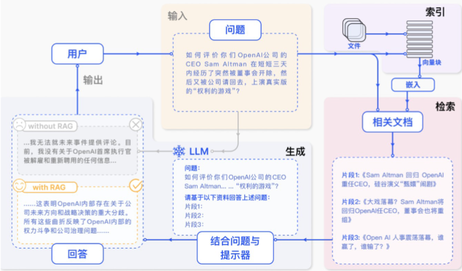
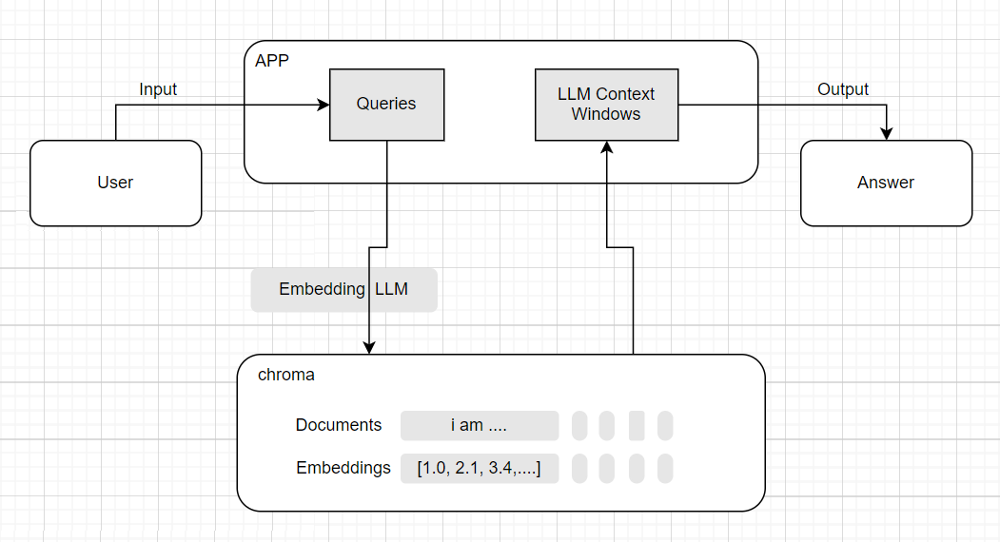

## 大模型的局限性

1. 时效性：模型训练的语料库截至时间之后，提问实时的东西很难得到回答
2. 覆盖性：一些私有数据集没有被包含在语料库中，模型训练的语料库无法涵盖所有领域的知识或特定领域的深度信息。
3. 幻觉：大模型在回答问题时若遇到非语料库包含的内容便会出现幻觉，答案缺乏可信度。

为了解决这些问题，需要给大模型外挂一个知识库进行参考，这就是RAG要做的事情。

> 提示词工程和微调能够解决知识更新缓慢和幻觉问题吗？
> 大模型微调（Fine-tuning），是在通用大模型的基础上，针对超出其范围或不擅长的特定领域或任务，使用专门的数据集或方法对模型进行相应的调整和优化，以提升其在该特定领域或任务中的适用性和性能表现。


## RAG简单搭建

**RAG (Retrieval-Augmented Generation/检索增强生成)**是一种结合了**检索**和**生成**两种方法的技术。它通过先检索相关的文档，用检索出来的信息对提示词**增强**，再使用大模型生成答案。

> 系统工作流程



### FastGPT

基于LLM大模型的开源AI知识库构建平台。提供了开箱即用的数据处理、模型调用、RAG检索、可视化AI工作流编排等能力。类似dify, cozed等。

[FastGPT官网链接](https://tryfastgpt.ai/)，进入其工作台中可以创建应用来实现RAG的工作流程，创建应用、添加知识库、定义提示词后，一个基于RAG的大模型应用就做好了
> 1. 模型选择
> 2. 定义提示词
> 3. 添加知识库
>    - 导入知识库文档
>    - 文档分块
>    - 生成文档块索引
>    - 索引向量化
>    - 生成向量知识库
>    - 关联知识库（可以多个）
> 4. 问答检验


## RAG研究范式

1. Native RAG
2. Advanced RAG
3. Modular RAG


## Native RAG

### 文档分块 chunk

> 分块策略
>   - 按照字符数来切分
>   - 按固定字符数结合滑动窗口(overlapping window)，防止语义不连贯
>   - 按照句子来切分
>   - 递归方法：RecursiveCharacterTextSplitter

### 向量化 embeddings

向量化就是用一个数值向量“表示”一个对象（Object）的方法。 
文本可以转换成向量（词向量），其他数据比如图片、声音等等也可以转化。
“数值化表示”就是一个编码向量。例如用（R，G，B）三元素向量编码表示一个实体颜色对象。

> 1. 将文本转成一组浮点数：每个数字，对应一个维度
> 2. 整个数组对应一个n维空间的一个点，即文本向量又叫Embeddings
> 3. 向量之间可以计算距离，距离远近对应语义相似度大小


### 在线向量化模型

> 1. 向量化模型可将文本、图像、视频等数据转换为数值向量，用于语义搜索、推荐、聚类、分类、异常检测等下游任务。
> 2. 专用于输出文本的「词向量」的神经网络模型就是我们所说的嵌入模型/向量模型。
> 3. 不同的嵌入模型即使是相同的文本，词向量也有可能不一样，比如不同的厂商，语料不一样或者向量的维度
不一样。

推荐在线调用[阿里百炼平台的向量化模型](https://bailian.console.aliyun.com/cn-beijing/?spm=5176.29597918.J_6OpWkxXiCZhFuDdhuKsC2.1.5809133ch6Of7v&tab=api#/api/?type=model&url=2712515)

> **需要安装的库**
> ```python
> # 手动安装方法（太麻烦并不建议）
> pip install openai
> pip install langchain
> pip install langchain-core
> pip install langserve
> pip install langchain-openai
> pip install langchain-community
> pip install chromadb
> ```

> **命令汇总**
> ```python
> # 创建一个虚拟环境
> python -m venv .rag
> 
> # 激活环境
> .rag/scripts/activate
> 
> # 查看已安装的包列表
> pip list
> 
> # cd /项目工作目录/,找到对应的requirements.txt 文件
> 
> # 使用requirements.txt 安装包
> pip install -r requirements.txt
> 
> # 根据最新的环境包状态生成 requirements.txt 文件
> pip freeze > requirements.txt
> 
> # 退出虚拟环境
> deactivate
> ```

### 本地部署向量化模型

借助Ollama开源框架，Ollama专为在本地机器上便捷部署和运行大模型而设计。

[Ollama官方网址](https://ollama.com/)，官网自行下载或者也可以打开终端执行以下命令：

> ```shell
> # 使用终端命令下载Ollama
> irm https://ollama.com/install.ps1 | iex
> 
> # 验证安装完成
> ollama
> 
> # 下载 bge-m3 模型
> ollama pull bge-m3
> 
> # 查看安装列表验证模型是否安装成功
> ollama list
> ```


### 向量相似度检索

1. 余弦相似度：；基于两个向量夹角的余弦值来衡量相似度  --- 值越接近 1.0 越相似
2. 欧式距离：；基于两个向量之间的欧几里得距离来衡量相似度  --- 值越小越相似
3. 点积：；计算两个向量之间的点积，适合归一化后的向量。


### 向量数据库索引

> 索引过程中将文本转为向量化表示，会产生很多的词向量，需要保存，谁来保存？
> 根据用户的查询，检索过程中要进行向量相似度计算，谁来计算？
> 数据库：存，取，查

**向量数据库(vector database)** 是一种专门设计用来**存储**和**查询**向量嵌入数据的数据库。

> 主流向量数据库功能
> 1. **Pinecone**  --- 闭源 --- 数据去重 --- 适合大型项目(数据达到亿级别)
> 2. **Milvus**  --- 开源 --- 毫秒级混合搜索、分布式部署 --- 适合大型项目
> 3. **chroma**  --- 开源 --- 轻量级快速部署 --- 适合中小型项目
> 4. **Faiss**   --- Meta开源 --- 并行处理 --- 适用图像检索和推荐系统




### 常用检索方法
关键字检索、全文检索和大模型中基于向量的相似度检索是信息检索领域中常用的三种技术

> 1. **关键字检索**：
检索速度快，如果用户输入的关键字能够准确地代表所需信息，且文本中该关键字的使用具有明确的指向性，那么可以得到较为准确的结果。但如果关键字具有歧义，或者文本中存在大量与关键字相关但语义不同的内容，可能会导致检索结果不准确，出现误判或漏判的情况。
> 2. **全文检索**：
通常比关键字检索更准确，因为它考虑了文本的整体内容和上下文信息。能够理解用户查询语句的语义，更精确地匹配相关文档，减少因关键字歧义或片面匹配导致的错误。不过，对于一些复杂的语义理解和模糊查询，全文检索可能也存在一定的局限性。
> 3. **基于词向量的相似度检索**：
在语义理解和准确匹配方面具有较大优势。大模型能够学习到文本中的深层语义信息，在处理复杂的语义查询和模糊匹配时表现较好，能够返回更符合用户意图的检索结果。

> 三者的应用场景不同，选择不同的检索方式，可以达到不同的效果。
> 全文检索：
> 停留在词级或短语级匹配，依赖显式关键词的精确或模糊匹配（如通配符、模糊查询），无法理解语义的深层关联。例如，查询“计算机”和“电脑”会被视为不同查询词，除非显式配置同义词库。基于关键词的统计特征（词频、文档频率、位置权重等），通过数学公式计算匹配度，如BM25、TF-IDF等算法，得分计算过程透明。
> 
> 基于词向量的相似度检索：
> 基于语义级理解，能捕捉文本的深层语义关联（如同义词、上下文歧义、逻辑推理）。例如，查询“如何修复笔记本故障”和文档“电脑主板维修指南”会因语义相似被判定为高相关，无需显式配置规则。向量是语义的黑盒表征，相似度计算结果难以直观解释全文检索基于关键词的统计匹配，侧重精确性和可解释性；大模型相似度基于语义向量的空间距离，侧重语义理解和泛化能力。在实际应用中，两者/三者常结合使用，形成“传统检索（关键词+精确匹配）+语义检索（向量+模糊匹配）”的混合架构，以兼顾效率、准确性和语义理解能力


### 混合检索

混合检索的本质是**同时执行**两路召回，然后融合，而非串行。

> AI应用中典型使用就是全文检索和向量检索的混合检索。
> - 向量数据库阶段
> 文档切片 → 生成向量 → 存储（原文 + 向量 + 倒排索引）到数据库
> - 问答检索阶段
>   - 用户提问 → **直接将完整问题**分别用于全文检索和向量检索
>   - 全文检索：用问题的关键词在倒排索引中使用**BM25算法**匹配切片原文
>   - 向量检索：将完整问题向量化，在向量库中用**欧氏距离**检索相似切片
>   - **融合排序RRF** 合并两路结果 → 取Top-K切片
>   - 将切片作为上下文 + 用户问题 → 提交给大模型生成答案
