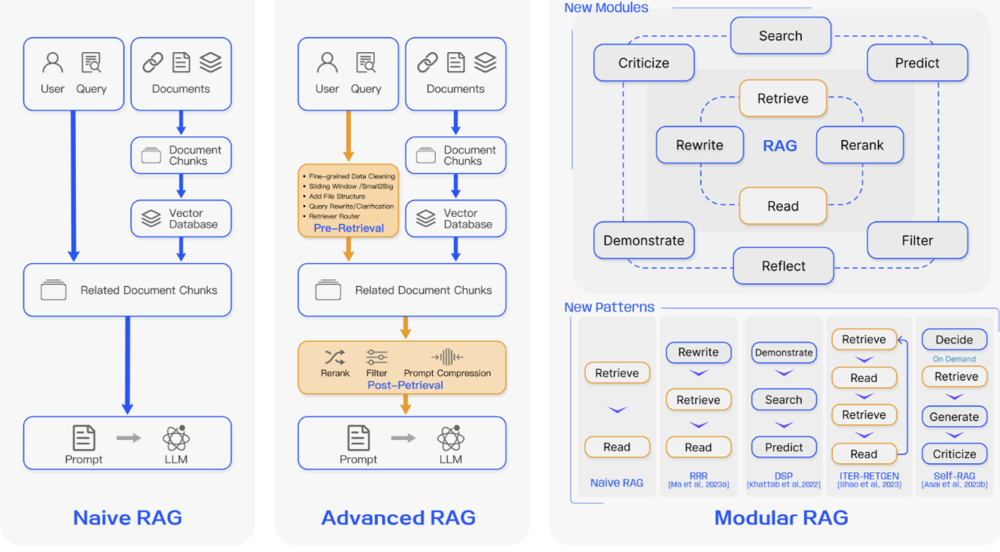

## 大模型的局限性

1. 时效性：模型训练的语料库截至时间之后，提问实时的东西很难得到回答
2. 覆盖性：一些私有数据集没有被包含在语料库中，模型训练的语料库无法涵盖所有领域的知识或特定领域的深度信息。
3. 幻觉：大模型在回答问题时若遇到非语料库包含的内容便会出现幻觉，答案缺乏可信度。

为了解决这些问题，需要给大模型外挂一个知识库进行参考，这就是RAG要做的事情。

> 提示词工程和微调能够解决知识更新缓慢和幻觉问题吗？
> 大模型微调（Fine-tuning），是在通用大模型的基础上，针对超出其范围或不擅长的特定领域或任务，使用专门的数据集或方法对模型进行相应的调整和优化，以提升其在该特定领域或任务中的适用性和性能表现。


## RAG简单搭建

**RAG (Retrieval-Augmented Generation/检索增强生成)**是一种结合了**检索**和**生成**两种方法的技术。它通过先检索相关的文档，用检索出来的信息对提示词**增强**，再使用大模型生成答案。

> 系统工作流程


### FastGPT

基于LLM大模型的开源AI知识库构建平台。提供了开箱即用的数据处理、模型调用、RAG检索、可视化AI工作流编排等能力。类似dify, cozed等。

[FastGPT官网链接](https://tryfastgpt.ai/)，进入其工作台中可以创建应用来实现RAG的工作流程，创建应用、添加知识库、定义提示词后，一个基于RAG的大模型应用就做好了
> 1. 模型选择
> 2. 定义提示词
> 3. 添加知识库
>    - 导入知识库文档
>    - 文档分块
>    - 生成文档块索引
>    - 索引向量化
>    - 生成向量知识库
>    - 关联知识库（可以多个）
> 4. 问答检验


## RAG研究范式

1. Native RAG
2. Advanced RAG
3. Modular RAG




## Native RAG

### 文档分块 chunk

> 分块策略
>   - 按照字符数来切分
>   - 按固定字符数结合滑动窗口(overlapping window)，防止语义不连贯
>   - 按照句子来切分
>   - 递归方法：RecursiveCharacterTextSplitter

### 向量化 embeddings

向量化就是用一个数值向量“表示”一个对象（Object）的方法。 
文本可以转换成向量（词向量），其他数据比如图片、声音等等也可以转化。
“数值化表示”就是一个编码向量。例如用（R，G，B）三元素向量编码表示一个实体颜色对象。

> 1. 将文本转成一组浮点数：每个数字，对应一个维度
> 2. 整个数组对应一个n维空间的一个点，即文本向量又叫Embeddings
> 3. 向量之间可以计算距离，距离远近对应语义相似度大小


### 在线向量化模型

> 1. 向量化模型可将文本、图像、视频等数据转换为数值向量，用于语义搜索、推荐、聚类、分类、异常检测等下游任务。
> 2. 专用于输出文本的「词向量」的神经网络模型就是我们所说的嵌入模型/向量模型。
> 3. 不同的嵌入模型即使是相同的文本，词向量也有可能不一样，比如不同的厂商，语料不一样或者向量的维度
不一样。

推荐在线调用[阿里百炼平台的向量化模型](https://bailian.console.aliyun.com/cn-beijing/?spm=5176.29597918.J_6OpWkxXiCZhFuDdhuKsC2.1.5809133ch6Of7v&tab=api#/api/?type=model&url=2712515)


### 本地部署向量化模型

借助Ollama开源框架，Ollama专为在本地机器上便捷部署和运行大模型而设计。

[Ollama官方网址](https://ollama.com/)，官网自行下载或者也可以打开终端执行以下命令：

```shell
# 使用终端命令下载Ollama
irm https://ollama.com/install.ps1 | iex

# 验证安装完成
ollama

# 下载 bge-m3 模型
ollama pull bge-m3

# 查看安装列表验证模型是否安装成功
ollama list
```


### 向量相似度检索

1. 余弦相似度：；基于两个向量夹角的余弦值来衡量相似度  --- 值越接近 1.0 越相似
2. 欧式距离：；基于两个向量之间的欧几里得距离来衡量相似度  --- 值越小越相似
3. 点积：；计算两个向量之间的点积，适合归一化后的向量。


