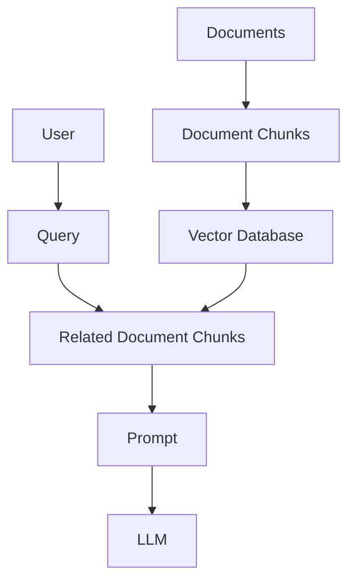

## 大模型的局限性

1. 时效性：模型训练的语料库截至时间之后，提问实时的东西很难得到回答
2. 覆盖性：一些私有数据集没有被包含在语料库中，模型训练的语料库无法涵盖所有领域的知识或特定领域的深度信息。
3. 幻觉：大模型在回答问题时若遇到非语料库包含的内容便会出现幻觉，答案缺乏可信度。

为了解决这些问题，需要给大模型外挂一个知识库进行参考，这就是RAG要做的事情。

> 提示词工程和微调能够解决知识更新缓慢和幻觉问题吗？
> 大模型微调（Fine-tuning），是在通用大模型的基础上，针对超出其范围或不擅长的特定领域或任务，使用专门的数据集或方法对模型进行相应的调整和优化，以提升其在该特定领域或任务中的适用性和性能表现。

## RAG简单搭建

**RAG (Retrieval-Augmented Generation/检索增强生成)**是一种结合了**检索**和**生成**两种方法的技术。它通过先检索相关的文档，用检索出来的信息对提示词**增强**，再使用大模型生成答案。

> 系统工作流程

### FastGPT

基于LLM大模型的开源AI知识库构建平台。提供了开箱即用的数据处理、模型调用、RAG检索、可视化AI工作流编排等能力。类似dify, cozed等。

[FastGPT官网链接](https://tryfastgpt.ai/)，进入其工作台中可以创建应用来实现RAG的工作流程，创建应用、添加知识库、定义提示词后，一个基于RAG的大模型应用就做好了
> 1. 模型选择
> 2. 定义提示词
> 3. 添加知识库
>    - 导入知识库文档
>    - 文档分块
>    - 生成文档块索引
>    - 索引向量化
>    - 生成向量知识库
>    - 关联知识库（可以多个）
> 4. 问答检验

## RAG研究范式

1. Native RAG
2. Advanced RAG
3. Modular RAG

### Native RAG

#### 文档加载和分块

> 分块策略
>   - 按照字符数来切分
>   - 按固定字符数结合滑动窗口(overlapping window)，防止语义不连贯
>   - 按照句子来切分
>   - 递归方法：RecursiveCharacterTextSplitter

